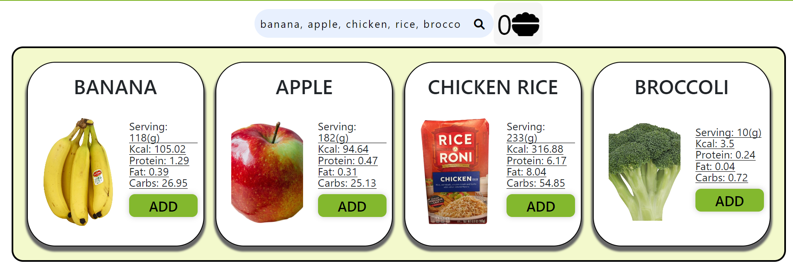

CICO Health is a web application developed by the team I led in the course SWP391 - Software Development Project. Designed as a fitness app, it provides essential features for users to manage their health and fitness regimen effectively. These features include logging daily meals with detailed macronutrient and energy information, recording various exercises like cardiovascular and resistance workouts, and offering comprehensive statistics for nutrition and exercise through interactive tables and charts.

#### **My Role: Project Manager and Lead Developer**

As the **Project Manager and Lead Developer** for CICO Health, my responsibilities encompassed both strategic leadership and hands-on technical development.

##### **Team Coordination and Leadership:**
- Spearheaded the project team, setting goals, timelines, and ensuring effective collaboration.
- Facilitated regular meetings and progress checks to maintain project momentum and team alignment.

##### **Resource Allocation:**
- Strategically allocated tasks based on team members' strengths and skill sets to optimize productivity and project outcomes.
- Managed time and resources efficiently to meet project deadlines and objectives.

##### **Quality Assurance:**
- Established high standards for code quality and functionality.
- Conducted regular code reviews and led testing initiatives to ensure the application's reliability and user satisfaction.

##### **Architecture Design:**
- Played a key role in the architectural design of the application, selecting a robust tech stack and defining the system's structure for scalability and maintainability.

##### **Feature Development:**
- Directly contributed to the development of core application features, focusing on user-centric design and functionality.
- Ensured seamless integration of meal and exercise logging features, along with detailed statistical analysis components.

##### **Code Review and Integration:**
- Oversaw the integration of code contributions from team members, ensuring consistency and compatibility with the application's overall design.
- Mentored junior developers, enhancing team capabilities and code quality.

##### **Troubleshooting and Problem Solving:**
- Acted as the primary troubleshooter for technical challenges, employing problem-solving skills to address and resolve issues efficiently.
<hr>

### Feature illustrations & code snippets

#### Looking up food
One core feature is finding information about common food items, I implemented it by using a third party API provided by Nutritionix

Using the feature is simple, just navigate to the Food Search page, then write out item names in natural language



The central front-end function written in JavaScript to serve search results:
```javascript
function sendRequest(query) {
  let request = new XMLHttpRequest();
  let url = "https://trackapi.nutritionix.com/v2/natural/nutrients"; //The URL to send the request to
  let body = {query: query}; //The food(s) to search for};
  let applicationID = "appid"; //The application ID
  let APIKey = "apikey"; //The API key

  request.open("POST", url, true); //Open the request
  //Set the request headers
  request.setRequestHeader("Content-Type", "application/json");
  request.setRequestHeader("x-app-id", applicationID);
  request.setRequestHeader("x-app-key", APIKey);

  //Set the request callback
  request.onreadystatechange = function () {
    if (request.readyState === XMLHttpRequest.DONE && request.status === 200) {
      let response = request.responseText; //Get the response
      response = JSON.parse(response); //Parse the response into JSON

      let foods = response.foods; //Get the foods array
      foods = removeDuplicate(foods); //Filter out duplicate foods

      dislpayFoods(foods); //Render the info in view
      
      addSearchResultEventListener(); //Add the search result event listener
      showSelected(selectedFoods);
    }
  };
  request.send(JSON.stringify(body)); //Send the request
}
```
### Nutrition statistics
Another important feature is nutrition statistics, this feature provides data visualization for the food you log over a period of times.

The app provides options such as data type, display type, start day and end day to customize how you want to view the data.

Below is Macronutrients statistics, displayed with multiple-line line chart:
 

JS code to serve the chart on front-end:
```javascript
function displayMacronutrientsChart(analyzedData, chartElement) {
  // Separate the macronutrient data
  const proteinData = analyzedData.map((obj) => obj.proteinConsumed);
  const fatData = analyzedData.map((obj) => obj.fatConsumed);
  const carbsData = analyzedData.map((obj) => obj.carbsConsumed);
  const dateLabels = analyzedData.map((obj) => obj.date);

  // Create the chart using Chart.js
  const ctx = chartElement.getContext("2d");
  if (displayedChart) displayedChart.destroy();
  const chart = new Chart(ctx, {
    type: "line",
    data: {
      labels: dateLabels,
      datasets: [
        {//Display protein line
        },
        {//Display fat line
        },
        {//Display carb line
        },
      ],
    },
    options: {//Display options
    },
  });
  return chart;
}
```

<hr>

Source: <a href="https://github.com/JosephPham324/CICOHealth-SWP391"><i class="large github icon "></i>JosephPham324/CICOHealth-SWP391</a>
