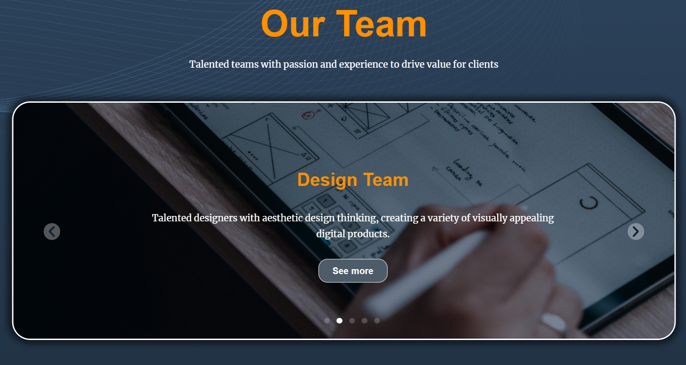
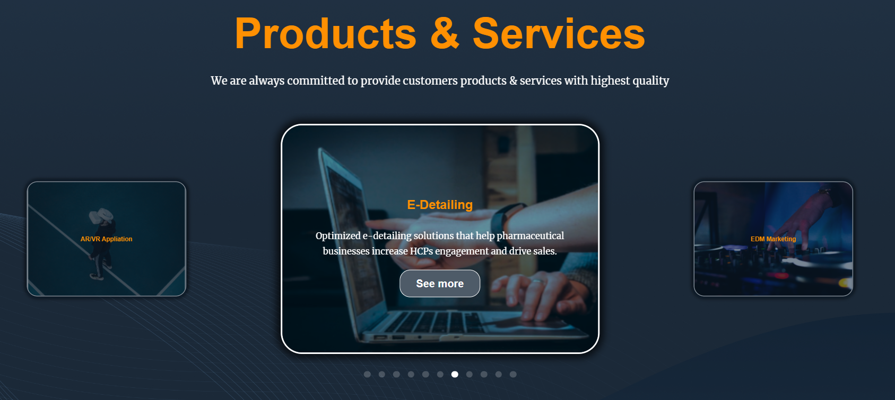

[UTA Website](https://utasolution.com) is the official website for UTA Solution, a leading technology company. As an intern during the summer of 2023, I had the opportunity to contribute to this exciting project.

Built with WordPress and Elementor, the UTA Website showcases customizability and aesthetic appeal. My role focused on developing the "About Us," "Our Team," and "Products & Services" sections of the home page.

**Key Learnings and Contributions:**

- **WordPress Proficiency:** Gained experience in publishing and monitoring pages.
- **Elementor Expertise:** Utilized a variety of pre-made and custom components for responsive design.
- **Professional Environment:** Honed my skills in communication and teamwork, reporting progress to the Project Manager and mentors.
- **Detail-Oriented Development:** Ensured adherence to project requirements and design.

A notable aspect of my work was creating interactive carousels for a dynamic user experience, prioritizing responsiveness and user interaction.

Explore the [UTA Solution Website](https://utasolution.com) to see the result of our collaborative efforts integrating WordPress and Elementor.

### About Us

### Our Team

### Products & Service

