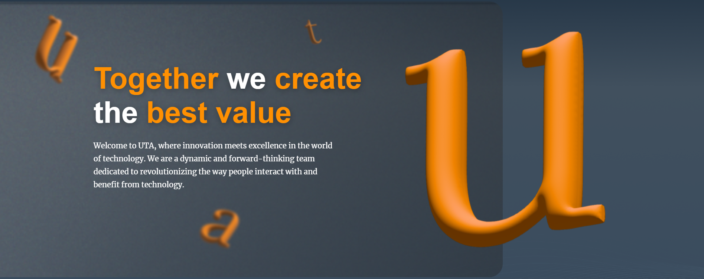
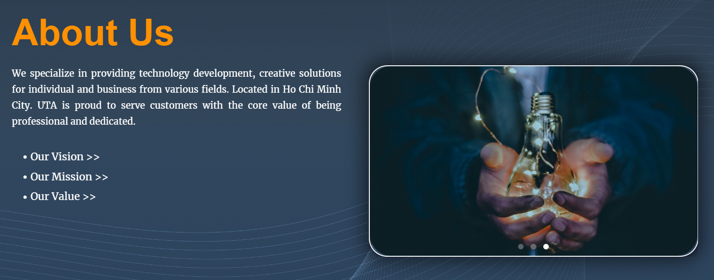

[UTA Website](https://utasolution.com) is the company website for UTA Solution, for which I interned in Summer 2023. The website was developed using WordPress and the Elementor plugin. My contribution to the project was developing parts of the home page (About Us, Our Team, Product and Service sections).

Participating in this projects, I have learned important skills, both technical and soft skills:
- Working with WordPress - publishing, monitoring pages.
- Working with Elementor - using pre-made and custom components, customize components CSS, responsive settings, etc.
- Working in a professional enviroment - logging and reporting task progress to the Project Manager and internship mentors.
- Effective communication and teamwork.
- Attention to details, adherence to requirements and design.

Summary of the parts I developed, they heavily involves carousels so I had to pay special attention to user interactions and responsiveness.

### About Us

### Our Team

### Products & Service

